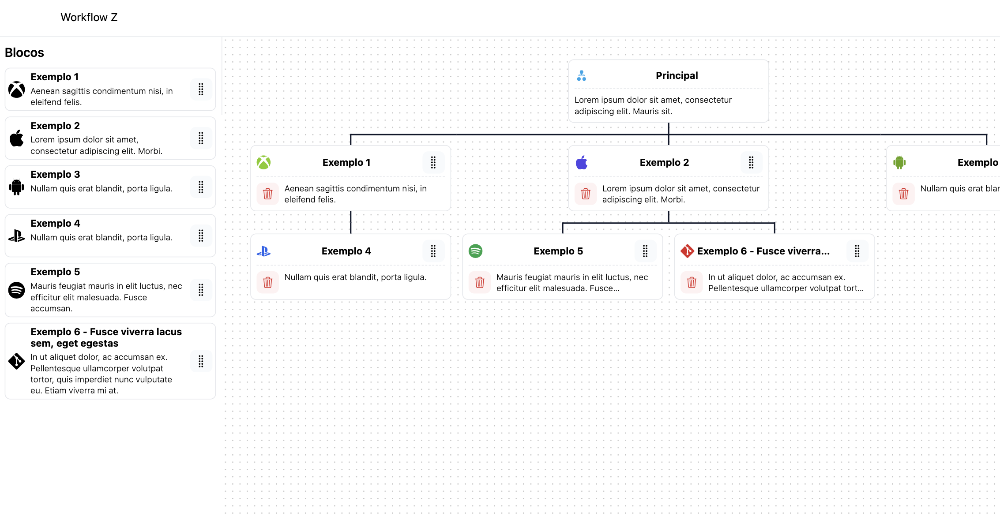

# 🚀 Desafio - Compay Z

Nesse desafio eu tomei a liberdade de ousar a não seguir os frameworks recomendados, o motivo de eu ter feito isso é poder demonstrar a minha capacidade de realizar desafios que me faz superar níveis de dificuldades, não tive o intuito de reinventar a roda, pelo fato que já existe há lib Flowy VueJS e nem desprezar o BootstrapVue, mas o que eu quero é poder mostrar que posso produzir as mesmas funcionalidades e ter a possibilidade de melhorar o que já existe, usando a minha expertise em VueJs e Tailwindcss, estou realizado com o resultado, não foi fácil chegar nele, onde senti mais dificuldades foi criar a estrutura do mapa mental tanto na estrutura de dados quanto a na componentização, trabalhar com matrizes sempre é desafiador por conta da complexidade, pelo limite de tempo ficou faltando finalizar a funcionalidade de drag end drop em dispositivos touch, que trabalham com outros tipos de eventos.
Vale destacar as inúmeras possibilidades que esse projeto nos permite, com base nele dá para construir uma aplicação de fluxos, acompanhamento de tarefas(rotinas), kanban e muitos outros.

## 👀 Visão geral

### 🏞️ Captura de tela



### 🔗 Links

- [Em produção URL](https://lambent-stardust-6aefb5.netlify.app/)

## 👨🏻‍💻 Meu processo

### 🛠️ Construído com

- [Zod](https://zod.dev/) - Validação de esquema TypeScript-first
- [Nuxtjs](https://nuxt.com/) - Vue Framework
- [Vitest](https://vitest.dev/) - Framework de Testes
- [Tailwindcss](https://tailwindcss.com/) - Utility-first CSS framework

## 🧲 Variáveis de ambiente

| Variável               | Valor padrão               |
| :--------------------- | :------------------------- |
| `NUXT_PUBLIC_API_BASE` | http://localhost:3000/json |
| `NUXT_PUBLIC_APP_NAME` | Workflow Z                 |

## 🧞 Comandos

Todos os comandos são executados a partir da raiz do projeto, a partir de um terminal:

| Comando               | Ação                                                             |
| :-------------------- | :--------------------------------------------------------------- |
| `npm install`         | Instala dependências                                             |
| `npm run dev`         | Inicia o servidor de desenvolvimento local em `localhost:3000`   |
| `npm run build`       | Construa a aplicação pronta para produção no diretório `.output` |
| `npm run generate`    | Pré-renderiza todas as rotas da aplicação                        |
| `npm run preview`     | Visualize sua compilação localmente, antes de implantar          |
| `npm run postinstall` | Cria um diretório `.nuxt` na aplicação e gera tipos              |
| `npm run test`        | Inicia o Vitest no diretório atual                               |
| `npm run coverage`    | Ativar relatório de cobertura                                    |

## ✍🏼 Autor

- [Me encontre](https://ercdev.com.br/)

---

# Desafio

# O que preciso fazer?

Vamos ser práticos e diretos, se você quer trabalhar conosco siga os passos abaixo:

- Faça um "fork" desse projeto para sua conta GitHub.
- Implemente o desafio descrito no tópico abaixo.
- Faça um push para seu repositório com o desafio implementado.

# Desafio

Você deverá criar 1 aplicação conforme apresentada no gif abaixo, seguindo um modelo de workflow que será explicado mais abaixo:


**Requisitos:**

Primeiro Workflow (Abaixo informaremos uma explicação mais detalhada dos Blocos do Workflow:

- Criar um workflow com o bloco principal chamado "MemberZ"
- Esse Bloco será dividido em "Usuário foi cadastrado?" e "Usuário não foi cadastrado?"
- Caso usuário cadastrado, após 1 minuto, uma ação de enviar email será realizada. Logo em seguida, depois de 3 minutos, um SMS será enviado.
- Caso usuário não cadastrado, tente novamente a persistência do usuário, após checar novamente se o cadastro foi realizado ou não, segue o fluxo conforme positivo ou negativo.

Segundo Workflow (Abaixo informaremos uma explicação mais detalhada dos Blocos do Workflow:

- Criar um workflow com o bloco principal chamado "ConvertZ"
- Esse Bloco será dividido em "Cliente já foi atendido?" e "Clienta não foi atendido?"
- Caso usuário atendido, após 1 minuto, uma ação de mudança de status para "Atendimento Finalizado". Logo em seguida, depois de 3 minutos, um SMS será enviado e depois de 2 minutos, um email de finalização de atendimento será enviado.
- Caso usuário não foi atendido, aguardar 3 minutos, mudar o status para "Em atendimento", e depois de 5 minutos, mudar o status para "Atendimento Finalizado". Logo em seguida, depois de 3 minutos, um SMS será enviado e depois de 2 minutos, um email de finalização de atendimento será enviado.

### Tecnologias

- [Utilizar a biblioteca Flowy VueJS](https://remcoplasmeyer.github.io/flowy-vue/home?ref=madewithvuejs.com)

#### FRONT-END

- Vue.js 2 ou 3 com Nuxt
- Typescript

* [Utilizar BootstrapVue](https://bootstrap-vue.org/)

**Recomendações gerais:**

- Não utilize frameworks que não foram indicados

### Arquitetura e documentação

No arquivo README do projeto explique o funcionamento e a arquitetura da solução adotada na sua implementação. Descreva também os passos para executar corretamente seu projeto.

### Avaliação

Entre os critérios de avaliação estão:

- Atenção aos detalhes
- Facilidade de configuração do projeto
- Performance
- Código limpo e organização
- Documentação de código
- Documentação do projeto (readme)
- Arquitetura
- Boas práticas de desenvolvimento
- Design Patterns
- Testes unitários

## JSONs de exemplo a serem utilizados na aplicação

### JSON de Workflows disponíveis

##### Metadata

| Nome da Coluna | Observacao             |
| -------------- | ---------------------- |
| id             | Identificador do Bloco |
| name           | Nome                   |

##### Example

```json
{
  "data": {
    "worflow": [
      {
        "id": 1,
        "name": "MemberZ"
      },
      {
        "id": 2,
        "name": "ConvertZ"
      }
    ]
  }
}
```

### JSON dados de um Bloco

##### Metadata

| Nome da Coluna | Observacao             |
| -------------- | ---------------------- |
| id             | Identificador do Bloco |
| name           | Nome do Bloco          |
| blocks         | Ações do Bloco         |

##### Example

**Explicação Primeiro Bloco:**

Este JSON representa um workflow chamado "MemberZ" com dois blocos: "Usuário foi cadastrado?" e "Usuário não foi cadastrado?". O bloco "Usuário foi cadastrado?" tem uma ação para verificar se o usuário está cadastrado e, em caso afirmativo, enviar um e-mail após 1 minuto e um SMS após 3 minutos. Se o usuário não estiver cadastrado, uma ação de persistência do usuário será realizada, seguida de uma verificação para ver se o cadastro foi concluído ou não. Se o cadastro foi concluído, o fluxo segue como descrito anteriormente. Se não, não há mais ações.

O bloco "Usuário não foi cadastrado?" tem uma ação para tentar novamente a persistência do usuário. Se for bem sucedida, segue o fluxo como descrito anteriormente. Caso contrário, não há mais ações.

```json
{
  "workflow": {
    "id": 1,
    "name": "MemberZ",
    "blocks": [
      {
        "name": "Usuário foi cadastrado?",
        "actions": [
          {
            "type": "check_user_registered",
            "timeout": 60000,
            "on_success": [
              {
                "type": "send_email",
                "timeout": 0
              },
              {
                "type": "send_sms",
                "timeout": 180000
              }
            ],
            "on_failure": [
              {
                "type": "persist_user",
                "timeout": 0
              },
              {
                "type": "check_user_registered",
                "timeout": 0,
                "on_success": [
                  {
                    "type": "send_email",
                    "timeout": 0
                  },
                  {
                    "type": "send_sms",
                    "timeout": 180000
                  }
                ],
                "on_failure": []
              }
            ]
          }
        ]
      },
      {
        "name": "Usuário não foi cadastrado?",
        "actions": [
          {
            "type": "persist_user",
            "timeout": 0,
            "on_success": [
              {
                "type": "check_user_registered",
                "timeout": 0,
                "on_success": [
                  {
                    "type": "send_email",
                    "timeout": 0
                  },
                  {
                    "type": "send_sms",
                    "timeout": 180000
                  }
                ],
                "on_failure": []
              }
            ],
            "on_failure": []
          }
        ]
      }
    ]
  }
}
```

**Explicação Segundo Bloco:**

Este JSON representa um workflow chamado "ConvertZ" com dois blocos: "Cliente já foi atendido?" e "Cliente não foi atendido?". O bloco "Cliente já foi atendido?" tem uma ação para verificar se o cliente já foi atendido e, em caso afirmativo, mudar o status para "Atendimento Finalizado" após 1 minuto, enviar um SMS após 3 minutos e um e-mail de finalização de atendimento após 2 minutos.
Se o cliente não tiver sido atendido, uma ação de espera de 3 minutos será realizada antes de mudar o status para "Em atendimento". Após 5 minutos, o status será mudado para "Atendimento Finalizado", seguido por um envio de SMS após 3 minutos e um e-mail de

```json
{
  "workflow": {
    "id": 2,
    "name": "ConvertZ",
    "blocks": [
      {
        "name": "Cliente já foi atendido?",
        "actions": [
          {
            "type": "check_customer_served",
            "timeout": 0,
            "on_success": [
              {
                "type": "change_status",
                "status": "Atendimento Finalizado",
                "timeout": 60000,
                "on_success": [
                  {
                    "type": "send_sms",
                    "timeout": 180000
                  },
                  {
                    "type": "send_email",
                    "timeout": 240000
                  }
                ],
                "on_failure": []
              }
            ],
            "on_failure": [
              {
                "type": "wait",
                "timeout": 180000,
                "on_success": [
                  {
                    "type": "change_status",
                    "status": "Em atendimento",
                    "timeout": 0,
                    "on_success": [
                      {
                        "type": "wait",
                        "timeout": 300000,
                        "on_success": [
                          {
                            "type": "change_status",
                            "status": "Atendimento Finalizado",
                            "timeout": 0,
                            "on_success": [
                              {
                                "type": "send_sms",
                                "timeout": 180000
                              },
                              {
                                "type": "send_email",
                                "timeout": 240000
                              }
                            ],
                            "on_failure": []
                          }
                        ],
                        "on_failure": []
                      }
                    ],
                    "on_failure": []
                  }
                ],
                "on_failure": []
              }
            ]
          }
        ]
      },
      {
        "name": "Cliente não foi atendido?",
        "actions": [
          {
            "type": "wait",
            "timeout": 0,
            "on_success": [
              {
                "type": "change_status",
                "status": "Em atendimento",
                "timeout": 180000,
                "on_success": [
                  {
                    "type": "wait",
                    "timeout": 300000,
                    "on_success": [
                      {
                        "type": "change_status",
                        "status": "Atendimento Finalizado",
                        "timeout": 0,
                        "on_success": [
                          {
                            "type": "send_sms",
                            "timeout": 180000
                          },
                          {
                            "type": "send_email",
                            "timeout": 240000
                          }
                        ],
                        "on_failure": []
                      }
                    ],
                    "on_failure": []
                  }
                ],
                "on_failure": []
              }
            ],
            "on_failure": []
          }
        ]
      }
    ]
  }
}
```
